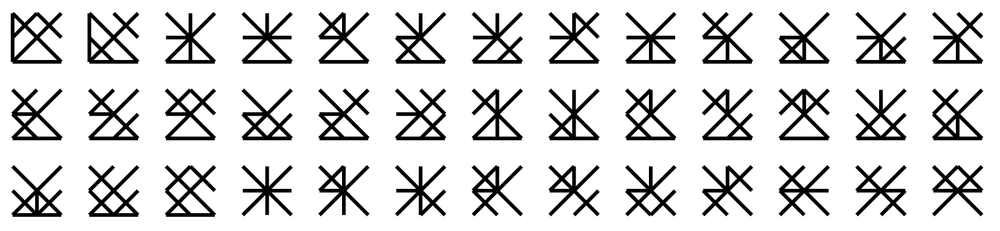

# glyphs-generator | [demo](https://v4nn4.github.io/glyphs-generator/)

A glyph generation tool with geometric constraints.

👉 Companion blog post: https://v4nn4.github.io/posts/glyph-generation/.

## Concept

The idea is to generate glyphs from a set of points on a grid. Since the number of possible glyphs increases exponentially with the number of points, we apply some geometrical constraints to narrow down our search. We then derive an efficient search algorithm.

## Playground

A playground is available [here](https://v4nn4.github.io/glyphs-generator/) for you to try! It is based on a blazing fast [Rust implementation](https://github.com/v4nn4/glyphs-generator-rs) that runs in the browser using WebAssembly and wasm-bindgen.
