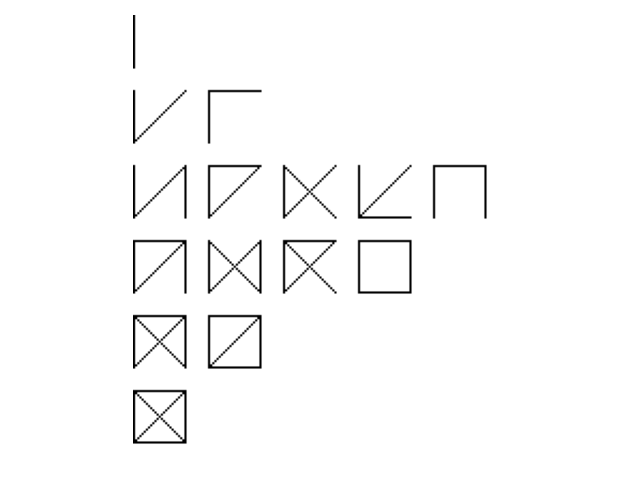

# glyphs-generator

A glyph generation tool with specified constraints:

- Glyphs are deemed identical if they can be converted into one another through rotation, or by flipping them horizontally or vertically
- With the exception of single-stroke glyphs, each stroke must intersect with another stroke

The tool examines a sequence of potential strokes and computes the equivalence classes for glyphs composed of any stroke combination.

## Alphabet generation

We generated alphabets based on some glyph primitives with 6 strokes or 8 strokes.

### 6-A

### 6-B

### 6-C

### 8-A

### 10-A

